# Number hunter :snowflake::fire:

Un juego creado para la [Numerica Twitch Jam](https://itch.io/jam/numerica-twitch-jam) que hará a los streamers solo ver números en el chat.
    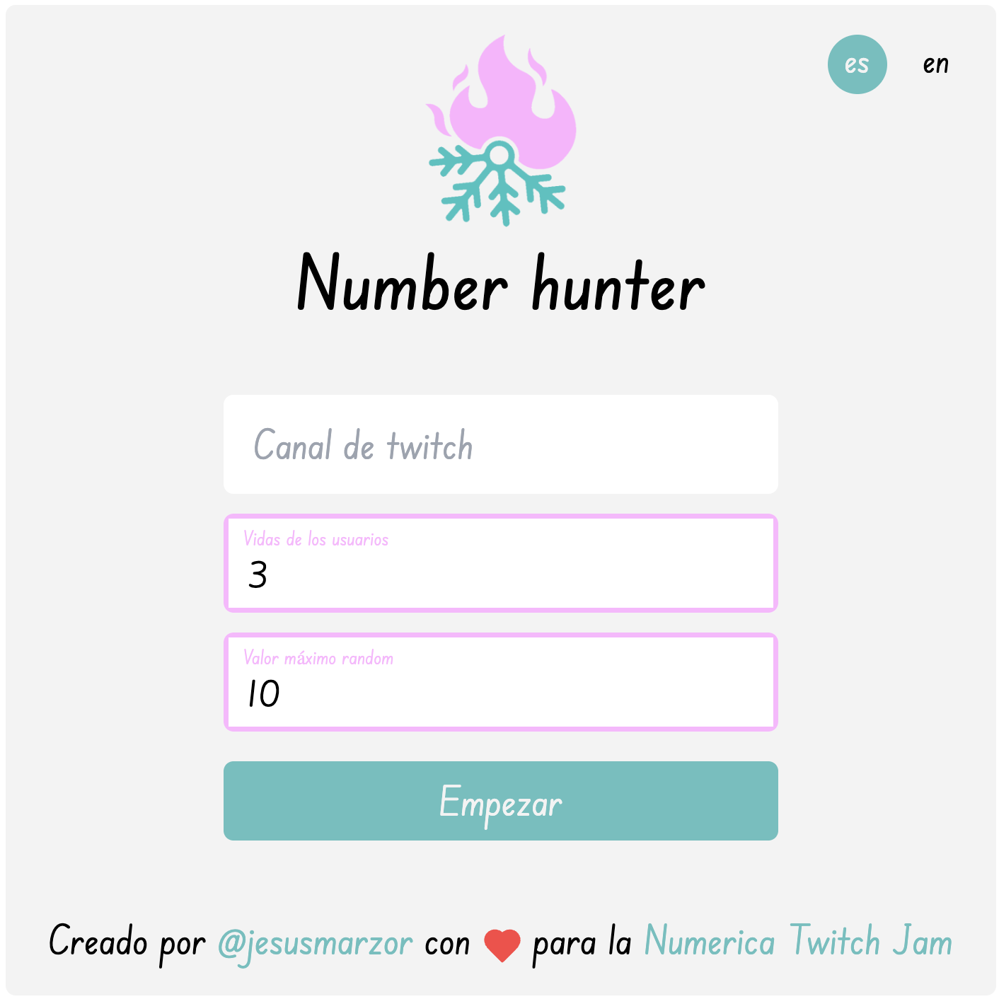

## Normas :page_with_curl:

- El proyecto debe tener integración con Twitch, como mínimo lectura del chat con conexión anónima. Debe tener una mecánica simple y tener inspiración en el mismo principio de cooperación / competición del juego original. :white_check_mark:

- El proyecto debe ser Open Source. Si usas el repositorio de Numerica, al ser licencia GPLv3, tienes que liberar el código del juego con la misma licencia. En el caso de que hagas el juego desde cero o solo uses el plugin de Very Simple Twitch Chat (licencia MIT), puedes liberar el código bajo la licencia que quieras. :white_check_mark:

- Debido a lo delicado de la Jam (exige tener permisos en la cuenta de Twitch del streamer) me reservo el derecho a eliminar cualquier participación sospechosa o que esté aprovechándose de los permisos de Twitch para recopilar datos o ser usada fraudulentamente. :white_check_mark: (Mejora futura)

- Se puede participar en solitario o por equipos, tantas entradas como se desee. :white_check_mark:

- Está permitido usar timeouts pero no está permitido banear permanentemente. Por motivos de seguridad, hay que explicar detalladamente qué va a hacer el juego con los permisos de Twitch. :white_check_mark: (Mejora futura)

## Resultado final :star:

Diferentes estados del juego:

- Iniciado por primera vez o reseteado.
    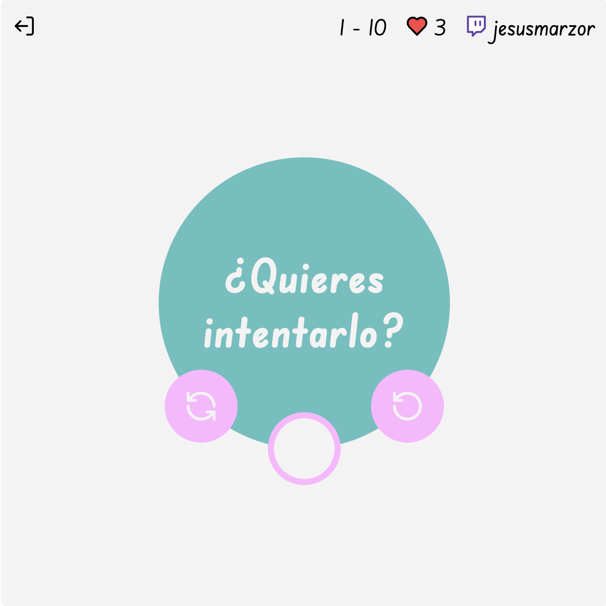

- jesusmarzor está en la lista de ganadores.
    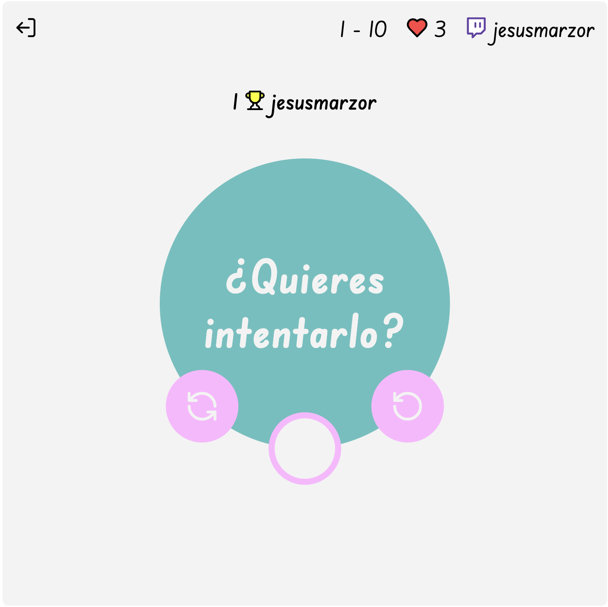

- jesusmarzor lo intenta con el número 6 pero se ha quedado cerca...
    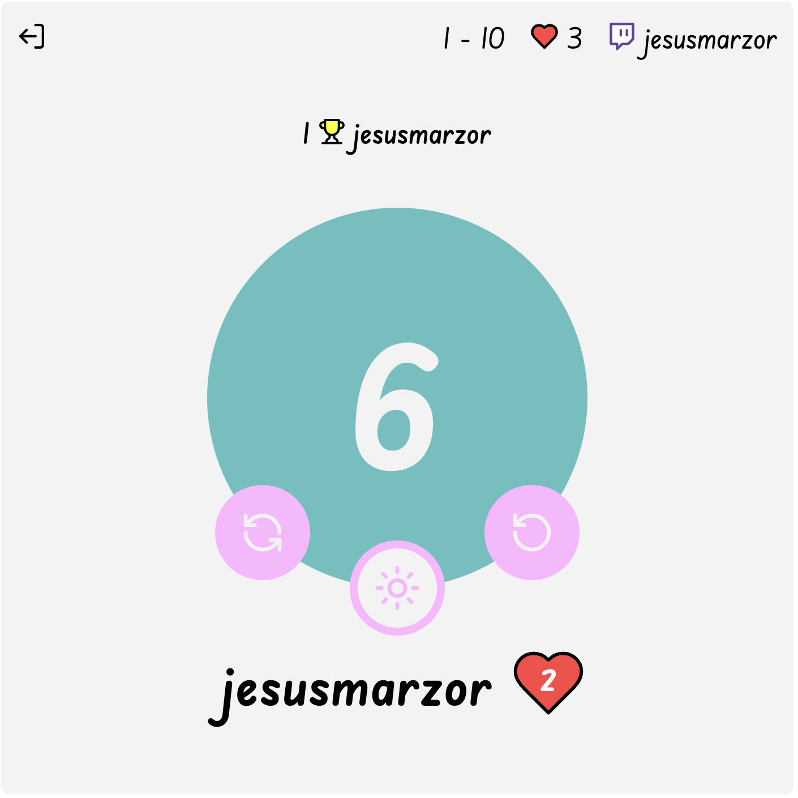

- jesusmarzor gana otra ronda.
    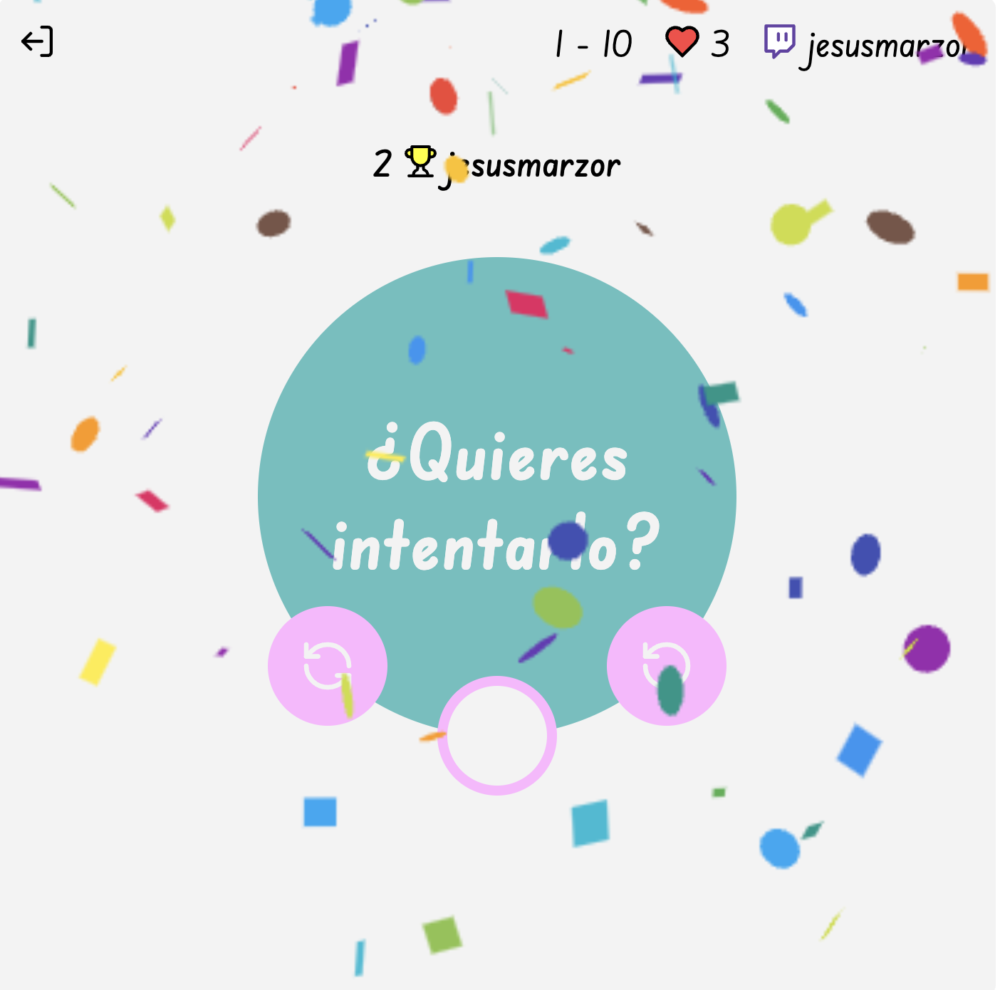

## Experiencia del streamer :video_game:

Explicación del diseño y experiencia de usuario del juego.

- En el login, arriba a la derecha nos encontramos los idiomas disponibles del juego.
    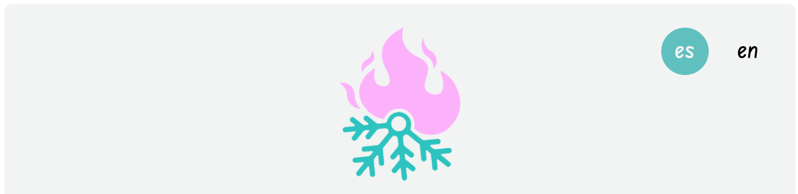

- En la pantalla de juego, nos encontramos 4 secciones en este orden:
    - Sección de información: se encuentran el icono de volver al login e información de la partida: rango de números permitidos en el juego, vidas iniciales de los jugadores por cada ronda y nombre del canal de twitch.
        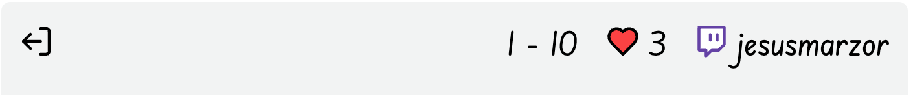

    - Sección de ganadores: aparecen los ganadores del juego. Máximo se muestran los 3 primeros en orden de rondas ganadas.
        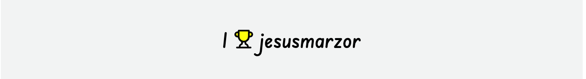

    - Sección de juego: aparece el último número que se ha intentado, el [icono central](#icono-central-firesunnypartly_sunnysnowflake) y dos botones:
        - :arrows_counterclockwise: : resetea el juego (se borran los ganadores y resetea el número objetivo).

        - :arrow_right_hook: : resetea la ronda (se mantienen los ganadores, solo resetea el número objetivo).

        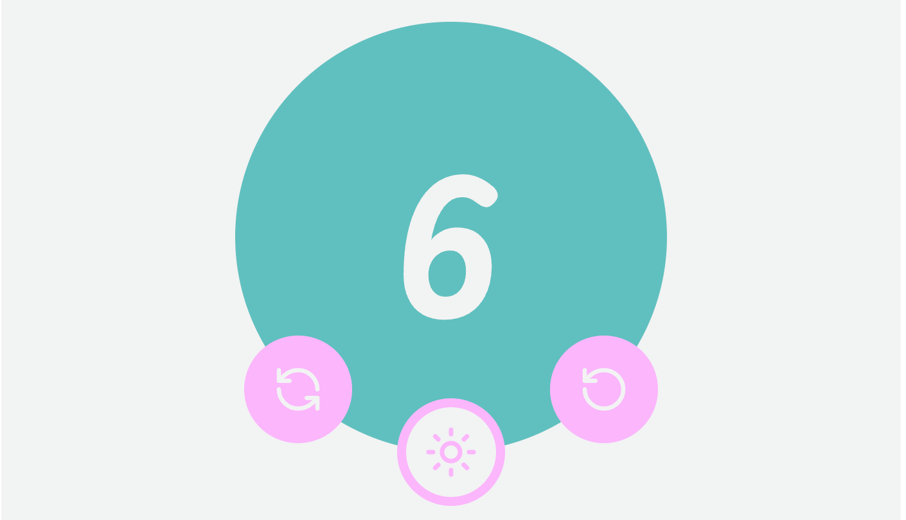
    
    - Sección del último participante: Aparece el último participante (su número aparece en la sección de juego) y se informa de las vidas que le quedan.
        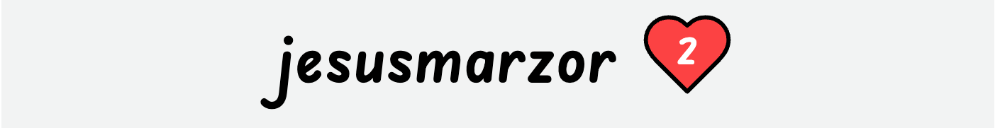

## Objetivo del juego :dart:

He querido darle una vuelta al objetivo de [numerica](https://github.com/rothiotome/numerica-twitch) sin dejar el principio de competición entre los jugadores.

El objetivo del juego es acertar un número generado aleatoriamente. Los jugadores tienen como pista el [icono central](#icono-central-firesunnypartly_sunnysnowflake). Cada vez que un jugador hace un intento y se pinta el número en pantalla, se muestra un icono que informa la cercanía del número objetivo.

## Icono central :fire::sunny::partly_sunny::snowflake:

:fire: : Indíca que el número objetivo está a 1 o 2 pasos. Por ejemplo si sale el número 10, el número objetivo estará entre estos números: 8, 9, 11, 12.

:sunny: : Indíca que el número objetivo está a 3 o 5 pasos. Por ejemplo si sale el número 10, el número objetivo estará entre estos números: 7, 6, 5, 13, 14, 15.

:partly_sunny: : Indíca que el número objetivo está a 6 o 10 pasos. Por ejemplo si sale el número 10, el número objetivo estará entre estos números: 1, 2, 3, 4, 16, 17, 18, 19, 20.

:snowflake: : Indíca que el número objetivo está a 11 o más pasos. Por ejemplo si sale en el número 10, el número objetivo estará entre estos números: 21, 22, 23 .... número máximo (elegido por el streamer).

## Reglas del juego :memo:

- Cada jugador tiene X vidas (eligidas por el streamer antes de comenzar el juego). Cada vez que el jugador escriba un número equivocado, perderá 1 vida. Cuando llegue a 0 vidas ya no podrá participar hasta que el número sea acertado y pasemos de ronda (se genere otro número).

- Cada jugador solo puede escribir un número por turno. Si sigue escribiendo números, el juego solo considerará valido el primero.

- El juego solo aceptará números entre el 1 y el X (elegido por el streamer antes de comenzar el juego).

## ¿Cómo preparar el juego? :rocket:

- Para streamear el juego, se puede hacer de dos formas:
    - Acceder al [juego](https://numberhunter.vercel.app) en un navegador y compartir en el *stream* la ventana del navegador.

    - Acceder al [juego](https://numberhunter.vercel.app) directamente desde **OBS**  poniendo como dimensiones **400x400**. Luego, para configurar el juego, dar click derecho a la fuente del juego y seleccionar **interactuar**.
        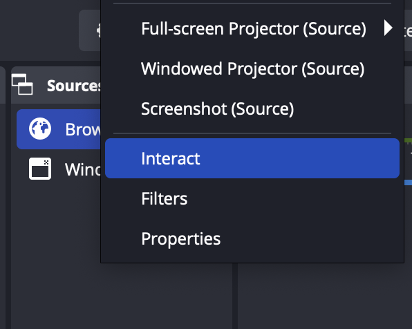

- La primera pantalla es el Login. Tendrás que introducir **el nombre de tu canal de twitch**, **un número de vidas** que consideres (por defecto se consideran 3 vidas) y **un número máximo** para tener un intervalo y generar los números aleatorios (por defecto se considera el número 10).

## Detalles Técnicos 📋

Este proyecto se ha desarrollado en Typescript con Vite. También ha sido necesario añadir estas librerías:

- [eslint](https://eslint.org/)
- [i18n](https://www.npmjs.com/package/i18n)
- [tailwindcss](https://tailwindcss.com/)
- [tmi.js](https://tmijs.com/)

**No se ha tenido en cuenta hacerlo responsive** ya que el juego está pensado para streamearlo en 400x400.

Las únicas llamadas que se hacen en el juego, son las que te ofrece la librería **tmi.js**

## Detalles Personales :clipboard:

Esta JAM me ha servido para apender la librería **tmi.js** con el api de twitch y seguir mejorando en el desarrollo Frontend.

Tengo claro que quiero dedicarle más cariño al juego y seguir con el [evolutivo](#mejoras-futuras-point_up).

Gracias [@rothiotome](https://github.com/rothiotome) por hacer que la gente considere la programación un entretenimiento.

## Mejoras futuras :point_up:

- Tests unitarios.
- Premios y castigos para los jugadores.

## Autor ✒️
Jesús Martín Zorrilla - Proyecto y documentación
- [Portafolio](https://jesusmarzor.vercel.app)
- [Linkedin](https://linkedin.com/in/jesusmarzor)

## Licencia 📄
Este proyecto está bajo la Licencia (GNU General Public License v3.0) - mirar el archivo [LICENSE](LICENSE) para más detalles.